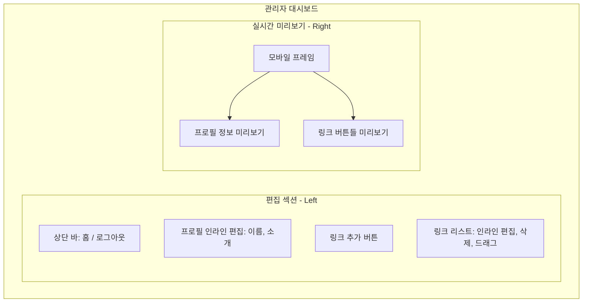
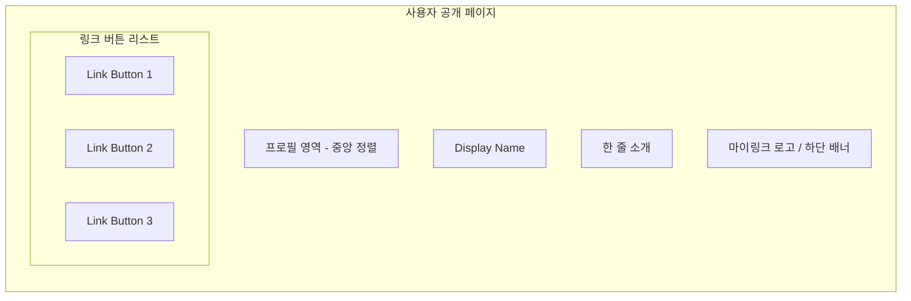

# 마이링크 와이어프레임 (Wireframe)

이 문서는 마이링크의 UI 구조를 머메이드(Mermaid) 다이어그램과 아스키(ASCII) 아트를 통해 설명합니다.

---

## 1. 관리자 페이지 (Admin / Editor Page)
관리자 페이지는 좌측의 **편집 섹션**과 우측의 **실시간 미리보기 섹션**으로 구성됩니다.

### 1.1 UI 구조 (Mermaid)


### 1.2 아스키 아트 와이어프레임
```text
################################################################################
#  [Home] [Share]                                             [Logout]         #
################################################################################
#                                                                              #
#  [ 편집 섹션 ]                         [ 실시간 미리보기 ]                   #
#  -----------------------               -----------------------               #
#  |                     |               |    /-------------\  |               #
#  |  Display Name (Edit)|               |    |   (IMAGE)   |  |               #
#  |  Bio (Edit)         |               |    |  Name/Bio   |  |               #
#  |                     |               |    |             |  |               #
#  |  [+ Add Link]       |               |    | [ Link 1 ]  |  |               #
#  |                     |               |    | [ Link 2 ]  |  |               #
#  |  -----------------  |               |    | [ Link 3 ]  |  |               #
#  |  [=] Title (Edit)   |               |    |             |  |               #
#  |      URL (Edit) [X] |               |    \-------------/  |               #
#  |  -----------------  |               -----------------------               #
#  |  [=] Title (Edit)   |                                                     #
#  |      URL (Edit) [X] |                                                     #
#  |  -----------------  |                                                     #
#                                                                              #
################################################################################
```

---

## 2. 사용자 공개 페이지 (User / Public Page)
사용자가 공유된 링크(@displayName)로 접속했을 때 보여지는 화면입니다.

### 2.1 UI 구조 (Mermaid)


### 2.2 아스키 아트 와이어프레임
```text
---------------------------------------
|                                     |
|                                     |
|               (IMAGE)               |
|            @Display_Name            |
|              Bio Text               |
|                                     |
|       /---------------------\       |
|       |     [Icon] Link 1   |       |
|       \---------------------/       |
|                                     |
|       /---------------------\       |
|       |     [Icon] Link 2   |       |
|       \---------------------/       |
|                                     |
|       /---------------------\       |
|       |     [Icon] Link 3   |       |
|       \---------------------/       |
|                                     |
|                                     |
|             ( My-Link )             |
|                                     |
---------------------------------------
```
